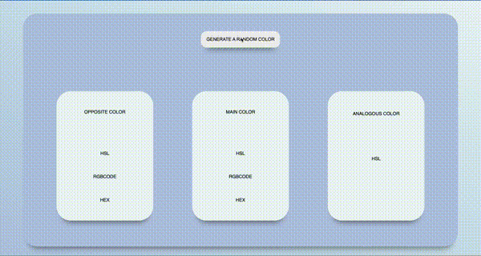

# Web Development Bootcamp - Random Color Generator

This is a desktop app that you can create random color and find it's analogous and complemantary colors.

## Table of contents

- [Overview](#overview)
  - [The challenge](#the-challenge)
  - [Screenshot](#screenshot)
- [My process](#my-process)
  - [Built with](#built-with)
  - [What I learned](#what-i-learned)
  - [Useful resources](#useful-resources)
- [Author](#author)

## Overview

This is a JavaScript OOP, Class, DOM Events parctise with HTML&CSS.

### The challenge

Users should be able to:

- Generate the random color by clicking button. After click, Main Color will be generated, The complamentary and analogous colors will be calculated and shown on the seperate cards.

### Screenshot



## My Process

### Built with

- HTML5
- CSS - Flexbox
- Vanilla JS - OOP, Class Usage, DOM Events
-

### What I learned

```html
<h1>Some HTML code I'm proud of</h1>
```

```js
//function for updates scores until one of the user reach to the winner score.
hex() {
        let rr = this.r.toString(16);
        let gg= this.g.toString(16) ;
        let bb = this.b.toString(16);
        rr = rr.length < 2 ? "0"+rr : rr;
        gg = gg.length < 2 ? "0"+gg : gg;
        bb = bb.length < 2 ? "0"+bb : bb;
        return `#${rr}${gg}${bb}`;
    }
btn.addEventListener('click', ()=>{
    //create a object for main color
    const c1 = new ColorMaker(randomise(),randomise(),randomise());

    //change background color of main color
    const mainBox = document.getElementById("color1")
    const RGB = `rgb(${c1.rgb()[0]},${c1.rgb()[1]},${c1.rgb()[2]})`;
    mainBox.style.backgroundColor = RGB;
});
```

### Useful resources

- [Web Development Bootcamp](https://www.udemy.com/course/the-web-developer-bootcamp/learn/lecture/22051276?start=420#overview) - This helped me for understanding OOP and Class- Methods in JS.

## Author

- Twitter - [@fly_pixie](https://twitter.com/fly_pixie)
