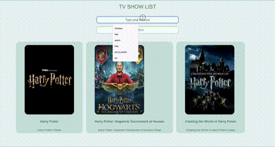

# Web Development Bootcamp - TV Show Searching App with AJAX and API

This is app you can search the keyword in search button. After that first ten movie will be listed on the page immediately.

## Table of contents

- [Overview](#overview)
  - [The challenge](#the-challenge)
  - [Screenshot](#screenshot)
- [My process](#my-process)
  - [Built with](#built-with)
  - [What I learned](#what-i-learned)
  - [Useful resources](#useful-resources)
- [Author](#author)

## Overview

This is a AJAX & API practise with HTML & CSS and VanillaJS.

### The challenge

Users should be able to:

- Searching the keyword by typing on the input
- Clicking the button to search movie names
- After click related movies will be listed on the page as movie card
- Clicking Movie Name's Detail link to go details of the movie web page

### Screenshot



## My Process

### Built with

- Semantic HTML5 markup
- Pure CSS
- Vanilla JS
- AJAX & API

### What I learned

```html
<h1>Some HTML code I'm proud of</h1>
```

```js
//function for API Request over Axios
const getRequest = async (searhedMovie) => {
    try{
        const response = await axios.get(endpoint, {params: {q: `${searhedMovie}`}});
        return response;
    } catch(err){
        return err;
    }
}
// all cards are created dynamically on JS
const addBoxOnScreen = (shows) => {
    const itemNums = shows.length;

    document.querySelector('.movielist').innerHTML = "";

    for(let i=0 ; i<itemNums ; i++) {
        const card = document.createElement("div");
        card.setAttribute("class", "card container");
        card.setAttribute("id", `main-card-${i}`);
        document.querySelector('.movielist').appendChild(card);
```

### Useful resources

- [Web Development Bootcamp](https://www.udemy.com/course/the-web-developer-bootcamp/learn/lecture/22051276?start=420#overview) - This helped me for understanding AJAX and API
- [ColorCode](https://www.youtube.com/watch?v=TnhCX0KkPqs&ab_channel=ColorCode) - This helped me for understanding JS Callbacks, Promises, Async and Await before AJAX - API

## Author

- Twitter - [@fly_pixie](https://twitter.com/fly_pixie)
